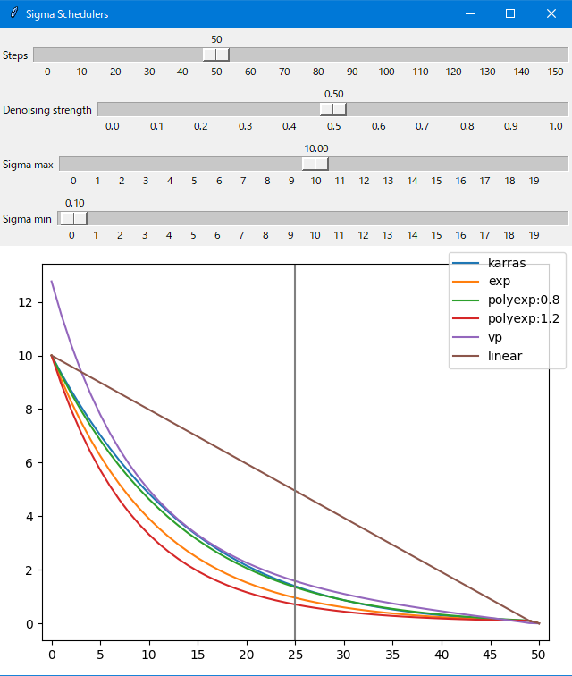
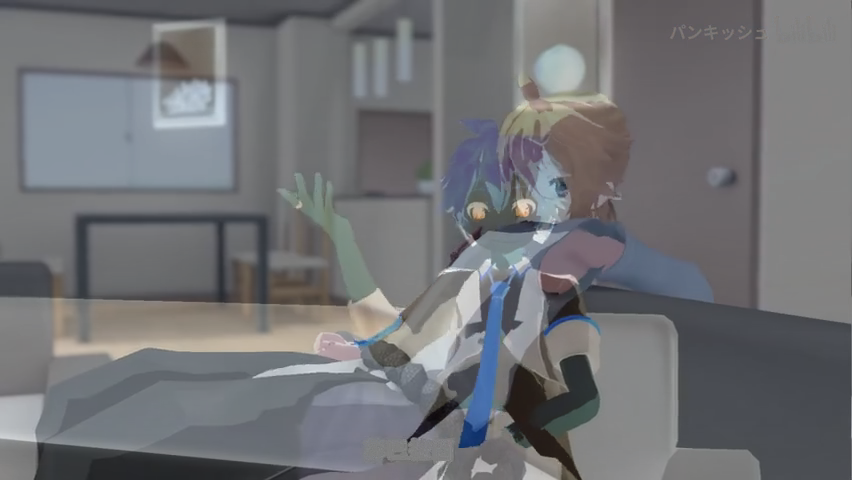
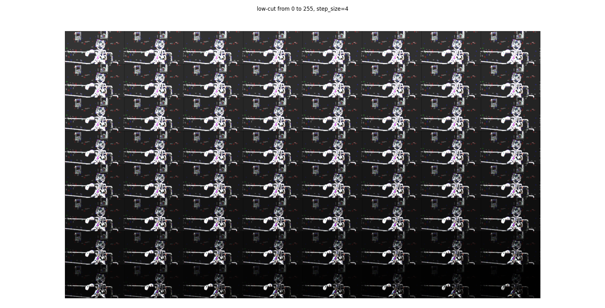
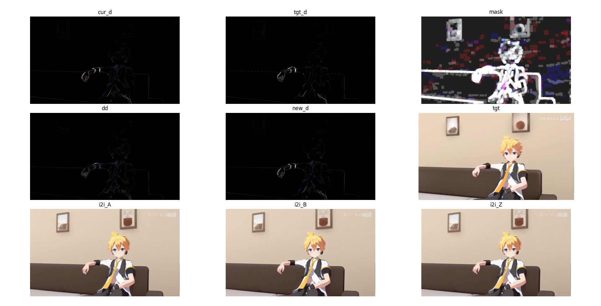
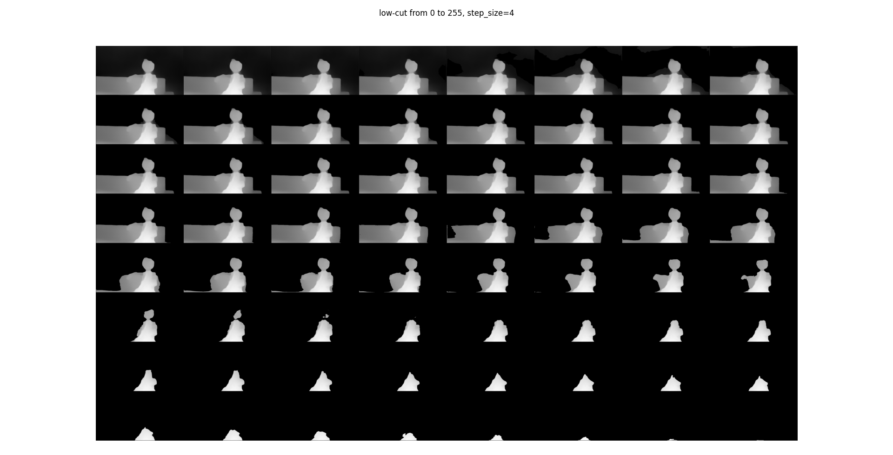

# stable-diffusion-webui-vid2vid

    Translate a video to AI generated video, extension script for AUTOMATIC1111/stable-diffusion-webui.

----

<p align="left">
  <a href="https://github.com/Kahsolt/stable-diffusion-webui-vid2vid/commits"></a>
  <a href="https://github.com/Kahsolt/stable-diffusion-webui-vid2vid/issues"></a>
  <a href="https://github.com/Kahsolt/stable-diffusion-webui-vid2vid/stargazers"></a>
  <a href="https://github.com/Kahsolt/stable-diffusion-webui-vid2vid/network"></a>
  
  
  <br/>
</p>


Convert a video to an AI generated video through a pipeline of model neural models: Stable-Diffusion, DeepDanbooru, Midas, Real-ESRGAN, RIFE, etc.  
Although it sounds like the old joke that an English wizard turns a walnut into another walnut by reciting a tongue-twisting spell. 🤣  

ℹ This script is only applicable in `img2img` tab :)  
⚠ some tasks will take a real long time, **DO NOT** click the button twice, juts see progress bar on console!!


Example: 

| vid2vid | original | img2img |
| :-: | :-: | :-: |
|  |  |  |

demo video original source:

  - title:【LEN/MMD】和风模组面前耍大刀【青月/蓝铁/妖狐】
  - url: [https://www.bilibili.com/video/BV1Vd4y1L7Q9](https://www.bilibili.com/video/BV1Vd4y1L7Q9)
  - bid: BV1Vd4y1L7Q9
  - uploader: パンキッシュ

parameters:

```
Prompts: (masterpiece:1.3), highres, kagamine_len, male_focus, 1boy, solo, indoors, looking_at_viewer, shirt, blurry_foreground, depth_of_field, blonde_hai , black_collar, necktie, short_ponytail, spiked_hair, yellow_necktie, bass_clef, blue_eyes, headphones, white_shirt, sitting, collar, sailor_collar, short_sleeves, upper_body, brown_hair, short_hair, yellow_nails, headset, room
Negative prompt: (((nsfw))), ugly,duplicate,morbid,mutilated,tranny,trans,trannsexual,mutation,deformed,long neck,bad anatomy,bad proportions,extra arms,extra legs, disfigured,more than 2 nipples,malformed,mutated,hermaphrodite,out of frame,extra limbs,missing arms,missing legs,poorly drawn hands,poorty drawn face,mutation,poorly drawn,long body,multiple breasts,cloned face,gross proportions, mutated hands,bad hands,bad feet,long neck,missing limb,malformed limbs,malformed hands,fused fingers,too many fingers,extra fingers,missing fingers,extra digit,fewer digits,mutated hands and fingers,lowres,text,error,cropped,worst quality,low quality,normal quality,jpeg artifacts,signature,watermark,username,blurry,text font ufemale focus, poorly drawn, deformed, poorly drawn face, (extra leg:1.3), (extra fingers:1.2),out of frame

Sampler: Euler
Width: 832
Heigh: 448
Resize mode: Just Resize
CFG Scale: 7
Seed: 114514

Extract FPS: 12
Extract fmt: png
Sampling steps: 20
Denoising strength: 0.85
Init noise weight: 1.0
Sigma method: exponential
Sigma sigma min: 0.1
Sigma sigma max: 1.2
Frame delta correction: std
Motion mask lowcut: 0
Depth mask lowcut: -1
RESR model: animevideov3-x2
RIFE model: rife-v4
Interpolation ratio: 2
Export fmt: mp4
```


### How it works?


⚪ Sigma schedule (overrided)

**Sigma schedule** controls the magnitude to denoise a latent image at each sampling step, and it should be an annealing process so that the final painting converges to some local optimal.  
This extension allows you to override the default sigma scheduling, now you can fine-tune the annealing process on your own.  

For sigmas tuning reference, see different schedule methods using the helper script [helpers/sigma_schedule.py](helpers/sigma_schedule.py):



Notes:

  - initial real sigma numbers for img2img (~1.0) are typically smaller than which used in txt2img (~10.0), not letting the denoiser to change image content toooo much
  - in old fashion, we would take a long `steps >= 50` with low `denoising strength ~= 0.5` to truncate the taling part of the whole sigma sequence given by the scheduler, in order to make the annealing steady
  - now with an overrided low initial sigma `sigma max ~= 1.0`, you can take shorter `steps` and higher `denoising strength`
  - for different schedulers, try `linear` and `exponential` first to understand the behaviour! 😀
  - before the real work, the `single img2img (for debug)` mode in tab `3: Successive Img2Img` is your playground to tune things~

⚪ Frame delta correction

The original batch img2img might still not be successive or stable in re-painted details even with fine-tuned sigma schedule. 🤔  
We apply **frame delta correction & motion mask** using frame delta info:  

- match the delta for generated frames with the originals in statistics
- use the delta as a kind of motion mask (rather depth mask)

|  |  |
| :-: | :-: |
| frame delta in most cases | frame delta on scene changing |

motion mask:



debug the motion mask:




⚪ Depth map mask

This is the more traditional way for masking...




### Installation

⚪ Auto install

- run `install.cmd`
- if you got any errors like `Access denied.`, try run it again until you see `Done!` without errors 😂

⚪ Maunal install

- install prompt-travel extension
  - `cd <SD>\extensions`
  - `git clone https://github.com/Kahsolt/stable-diffusion-webui-prompt-travel.git`
  - `cd stable-diffusion-webui-prompt-travel\tools`
  - run `install.cmd` to install the post-processing tools
- install MiDaS
  - `cd <SD>\repositories`
  - `git clone https://github.com/isl-org/MiDaS.git midas`
  - download `https://github.com/AlexeyAB/MiDaS/releases/download/midas_dpt/midas_v21_small-70d6b9c8.pt` put under `<SD>\models\midas\`


#### Acknowledgement

- FFmpeg: [https://ffmpeg.org](https://ffmpeg.org)
- MiDaS: [https://github.com/isl-org/MiDaS](https://github.com/isl-org/MiDaS)
- stable-diffuison-webui: [https://github.com/AUTOMATIC1111/stable-diffusion-webui](https://github.com/AUTOMATIC1111/stable-diffusion-webui)
  - TorchDeepDanbooru: [https://github.com/AUTOMATIC1111/TorchDeepDanbooru](https://github.com/AUTOMATIC1111/TorchDeepDanbooru)
  - depthmap2mask: [https://github.com/Extraltodeus/depthmap2mask](https://github.com/Extraltodeus/depthmap2mask)
  - prompt-travel: [https://github.com/Kahsolt/stable-diffusion-webui-prompt-travel](https://github.com/Kahsolt/stable-diffusion-webui-prompt-travel)
- Real-ESRGAN-ncnn-vulkan: [https://github.com/xinntao/Real-ESRGAN-ncnn-vulkan](https://github.com/xinntao/Real-ESRGAN-ncnn-vulkan)
- rife-ncnn-vulkan: [https://github.com/nihui/rife-ncnn-vulkan](https://github.com/nihui/rife-ncnn-vulkan)

----

by Armit
2023/01/20 
